# Integrate Google maps with custom style and track user location in react-native

In recent years, location tracking of products/services provided by businesses has become a vital part for businesses as well as customers as it provides them with live updates.

In one of our health and fitness based apps, we had requirement of integrating map with custom style and track location of user while performing activities such as running or cycling.

In this blog, I will walk you through steps for integrating maps with custom style and track location of user using react-native

## Pre-requisites

- API key for maps: If you don't have one, refer [https://developers.google.com/maps/documentation/javascript/get-api-key](https://developers.google.com/maps/documentation/javascript/get-api-key)
- basic knowledge of react-native

So let's get started.

## 1. Initialize project:

Let's create our project by running
`react-native init integrating_custom_maps`.

At the time of writing this blog following are list of dependencies:

- "react": "16.9.0",
- "react-native": "0.61.2"
- Cocoapods(for iOS):"1.7.5"
- "react-native-maps":"0.26.1"

## 2. Add react-native-maps and link it

Next we add react-native-maps package from Airbnb, which has great support from community. In our terminal we run
`npm install react-native-maps --save-exact` and auto-link it by running `react-native link react-native-map`.

## 3. Load default map

Let's first load default Google map using react-native-maps for iOS and Android.

**Enabling Google maps for iOS using Cocoapods:**

- Run `cd ios && pod install` to install react-native-maps dependency for iOS

  
  _pod installation_

- Copy the Google API key and paste it in AppDelegate.m file as follows:

  `+ #import <GoogleMaps/GoogleMaps.h>`
  `@implementation AppDelegate`
  `...`
  `- (BOOL)application:(UIApplication *)application didFinishLaunchingWithOptions:(NSDictionary *)launchOptions {`
  `+ [GMSServices provideAPIKey:@"_YOUR_API_KEY_"]; // add this line using the api key obtained from Google Console`
  `...`

- Next, we create a component called Map and import MapView component of react-native-maps

  

  _folder structure_

  `import MapView from 'react-native-maps';`

- Render map as follows in Map component:

_Map component_

and in App.js add Map component as follows:

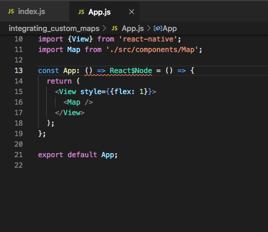

On running command `react-native run-ios` we get following output:

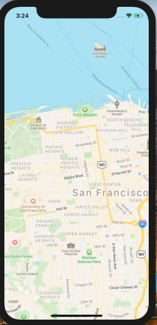

_default map_

**Enabling Google maps for Android:**
For enabling Google maps on Android we just need few steps as most of the job is done by auto-linking feature.

- Add `googlePlayServicesVersion = "16.0.0"` and `androidMapsUtilsVersion = "0.5+"` in **./android/build.gradle** file as follows:

  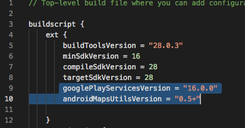

  _build.gradle_

- Add meta tag with you API key in AndroidManifest.xml as follows:

  

  _AndroidManifest.xml_

  That's all. Run the project with `react-native run-android` and we have the map on our screen

  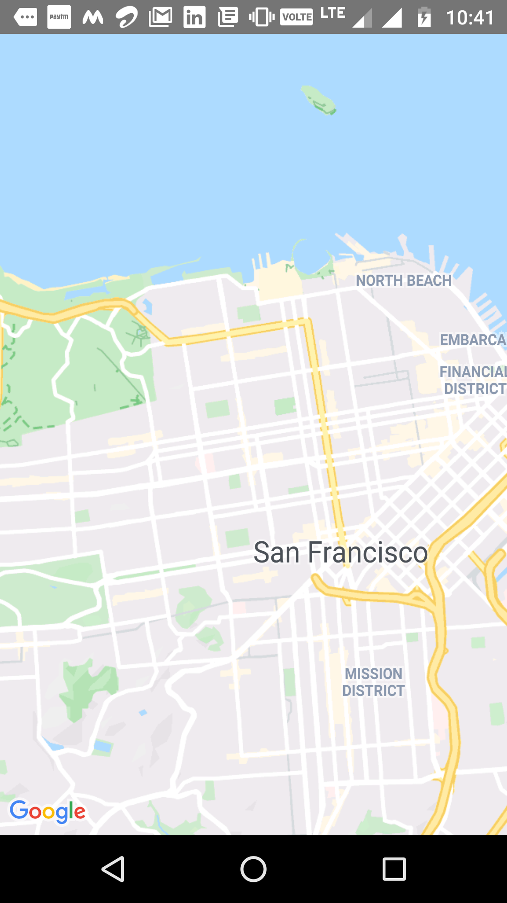

  _default map on Android_

## 4. Customize Google Maps:

Now that we have loaded default map, let's customise our maps. Google has it's own **Google Maps Platform Styling Wizard** which helps us in customization of maps.

- Go to https://mapstyle.withgoogle.com/ and click on **CREATE A STYLE** button
- Select a theme
- Click on **More Options** to add more customisations.Play around with different options and customize according to your needs.
- After having done with customisations, click on **Finish**. This generates JSON for our style. Copy this JSON.
- Create a folder and name it as 'constants' in src.
- Create a file called **mapStyle.json** and paste the JSON of style in it.

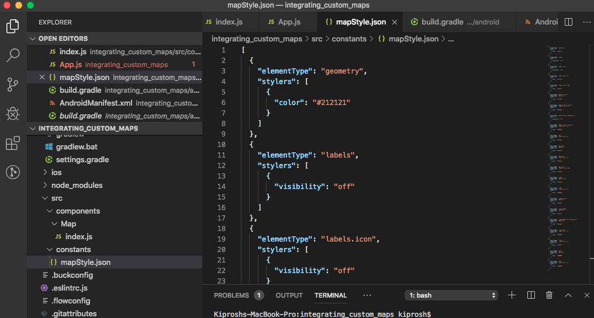

_mapStyle.json_

- Import PROVIDER_GOOGLE as constant from react-native-maps. This is needed for iOS.
- Now, update MapView component as following:

  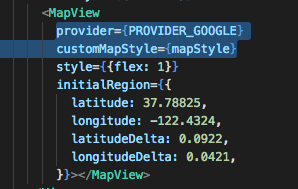

  _MapView component_

- Run the project.

  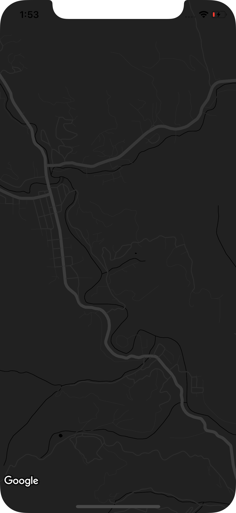

  _customized map_

## 5. Add Geolocation service:

Before tracking user location, let's add a Marker which will help us know where we are on this planet.

For knowing our location, we add `react-native-geolocation-service` package by running
`npm install react-native-geolocation-service`

- After installing, for iOS run `pod install`.Autolinking will take care of installing dependencies in Android.
- For Android: Allow app to aceess location by modifying AndroidManifest.xml as follows:

  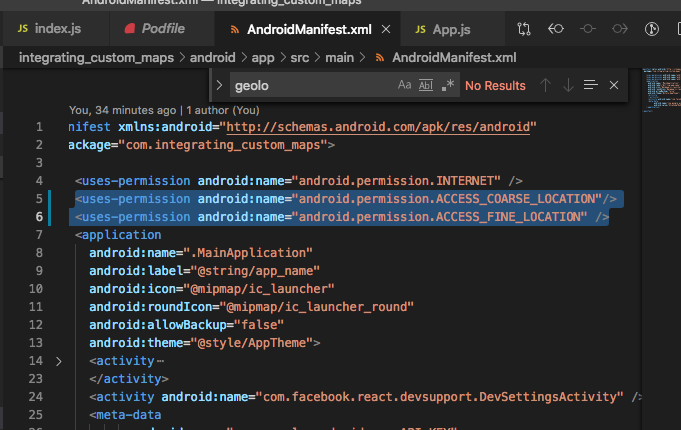

  _adding location permissions in AndroidManifest.xml_

## 6. Get current location:

Let's get our current position on the map. For this,

- Import Geolocation service in Map.jsx
- Add state variables for latitude,logitude and position coordinates array.
- In componentDidMount(), listen to `getCurrentPosition()` event as follows and set state variables.

  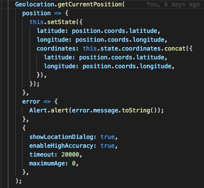

  _getCurrentPosition() handler_

  `getCurrentPosition()` takes success callback,error callback and options as parameters.You can refer official docs from https://github.com/Agontuk/react-native-geolocation-service and configure accordingly

- Change `initialRegion` prop of Map to `region` and add marker for your location

  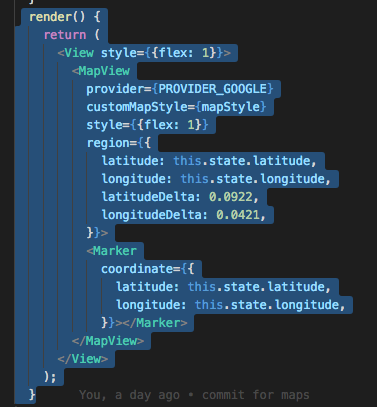

  _adding Marker component_

* Finally, we can find ourselves on the map.

  

  _location marker_

## 7. Track location change:

To track change of location on the map, we have to listen to watchPosition event.

- Add handler for `watchPosition` event and update the coordinates array as follows

  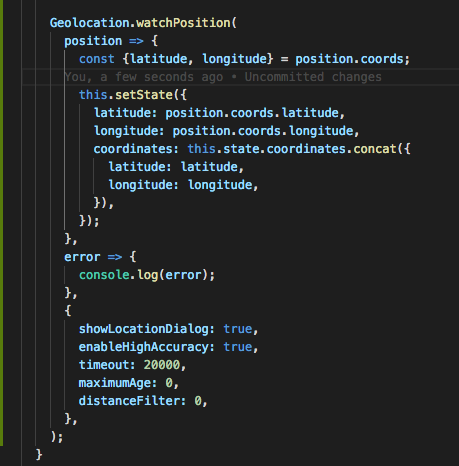

  _watchPosition() handler_

- Next we import Polyline as constant from `react-native-maps` and add which will help us locate our changed position on the map and also give us feel of our location being tracked.

  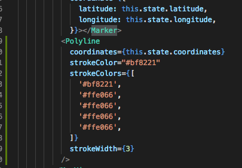

  _Polyline component_

Now whenever our GPS senses change in location,
handler of watchPosition event will be called which will give us current coordinates. These current coordinates will be concatenated to coordinates array of state which is provided as coordinates props to Polyline. This will create a tracker on the map for our location.

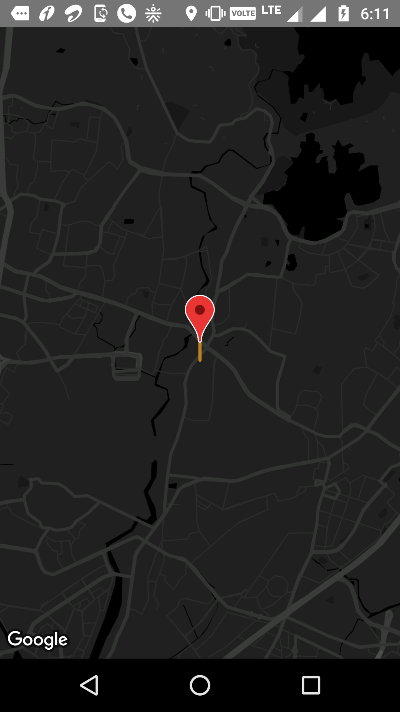
_location being tracked_

You can clone the repo from https://github.com/pranaybinju/integrating_custom_maps and experiment with the same.

Thank you!

## References

- react-native-geolocation-service official docs:
  https://github.com/Agontuk/react-native-geolocation-service

- react-native-maps official docs: https://github.com/react-native-community/react-native-maps

- Google Maps Platform Styling Wizard:
  https://mapstyle.withgoogle.com/

- Why does your app essentially require geolocation: https://www.mindinventory.com/blog/benefits-of-geolocation-in-mobile-app/

- How to use geolocation api: https://flaviocopes.com/geolocation-api/

- React native google map with react-native-maps:
  https://codeburst.io/react-native-google-map-with-react-native-maps-572e3d3eee14
