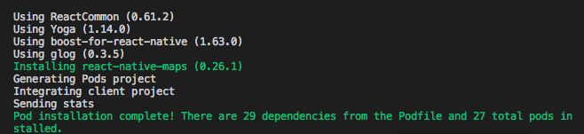
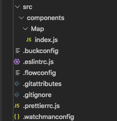
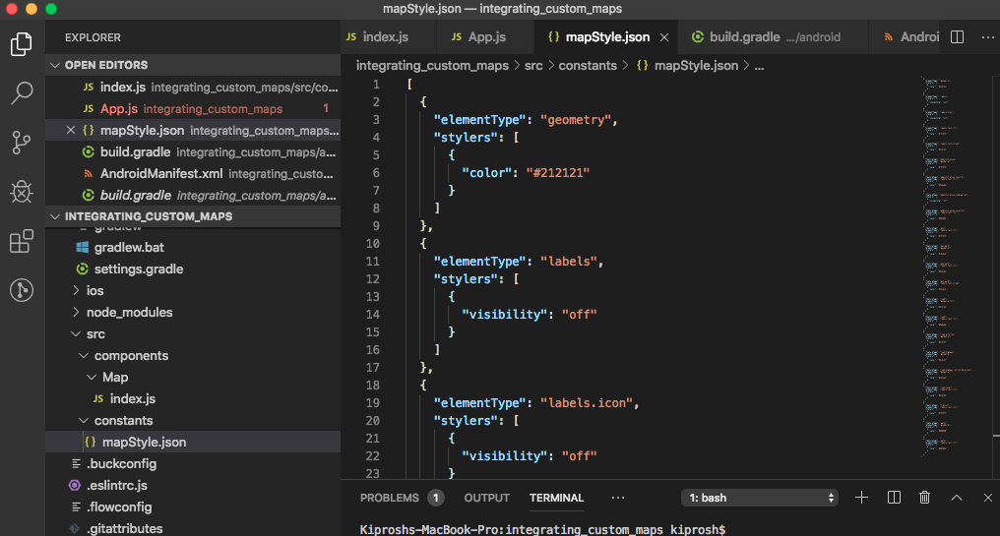
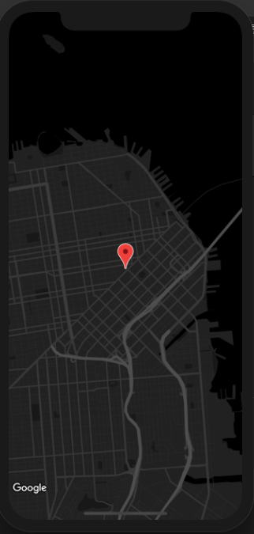

# Integrate Google maps with custom style and track user location in react-native

In recent years, location tracking of products/services provided by businesses has become a vital part for businesses as well as customers as it provides them with live updates.

In one of our health and fitness-based apps, we had a requirement of integrating the map with custom style and track location of the user while performing activities such as running or cycling.

In this blog, we will walk you through steps for integrating Google Maps with custom style and tracking the location of the user using `react-native`.

## Pre-requisites

- Google Map API key for maps (If you don't have one, refer [Get Google Map API Key](https://developers.google.com/maps/documentation/javascript/get-api-key))
- Basic knowledge of `react-native`

So let's get started.

## 1. Initialize project:

Let's create our project by running
`react-native init integrating_custom_maps`.

At the time of writing this blog following are list of dependencies:

- `react` (v16.9.0),
- `react-native` (v0.61.2)
- `Cocoapods`(v1.7.5) (for iOS)
- `react-native-maps` "0.26.1"

## 2. Add react-native-maps and link it

Next, we add `react-native-maps` package from Airbnb, which has great support from the community. In our terminal, we run
`npm install react-native-maps --save-exact` and auto-link it by running `react-native link react-native-map`.

## 3. Load default map

Let's first load the default Google map using `react-native-maps` for iOS and Android.

**Enabling Google maps for iOS using Cocoapods:**

- Run `cd ios && pod install` to install `react-native-maps`dependency for iOS.

  
  _pod installation_

- Import `GoogleMaps` header file in `AppDelegate.m` as follows

```m
#import <GoogleMaps/GoogleMaps.h>
```

- Copy the Google API key and paste it in `AppDelegate.m` file as follows

```m
- (BOOL)application:(UIApplication *)application didFinishLaunchingWithOptions:(NSDictionary *)launchOptions
{
[GMSServices provideAPIKey:@"YOUR_API_KEY"];
RCTBridge *bridge = [[RCTBridge alloc] initWithDelegate:self launchOptions:launchOptions];
RCTRootView *rootView = [[RCTRootView alloc] initWithBridge:bridge
                                                 moduleName:@"integrating_custom_maps"
                                          initialProperties:nil];

rootView.backgroundColor = [[UIColor alloc] initWithRed:1.0f green:1.0f blue:1.0f alpha:1];

self.window = [[UIWindow alloc] initWithFrame:[UIScreen mainScreen].bounds];
UIViewController *rootViewController = [UIViewController new];
rootViewController.view = rootView;
self.window.rootViewController = rootViewController;
[self.window makeKeyAndVisible];
return YES;
}
```

- Next, we create a component called `Map` and import `MapView` component of `react-native-maps`

  

  _folder structure_

  `import MapView from 'react-native-maps';`

- Render map as follows in `Map` component:

```js
import React from "react";
import { View, Text } from "react-native";
import MapView, { PROVIDER_GOOGLE, Marker } from "react-native-maps";
import { mapStyle } from "../../constants/mapStyle";
export default class Map extends React.Component {
  render() {
    return (
      <View style={{ flex: 1 }}>
        <MapView
          provider={PROVIDER_GOOGLE}
          customMapStyle={mapStyle}
          style={{ flex: 1 }}
          initialRegion={{
            latitude: 37.78825,
            longitude: -122.4324,
            latitudeDelta: 0.0922,
            longitudeDelta: 0.0421
          }}></MapView>
      </View>
    );
  }
}
```

and in `App.js` add `Map` component as follows:

```jsx
import React from "react";
import { View } from "react-native";
import Map from "./src/components/Map";

const App = () => {
  return (
    <View style={{ flex: 1 }}>
      <Map />
    </View>
  );
};

export default App;
```

On running command `react-native run-ios` we get following output:


_default map_

**Enabling Google maps for Android:**
For enabling Google maps on Android we just need few steps as most of the job is done by auto-linking feature.

- Add `googlePlayServicesVersion = "16.0.0"` and `androidMapsUtilsVersion = "0.5+"` in **./android/build.gradle** file as follows:

```gradle
...
buildscript {
    ext {
        ...
        googlePlayServicesVersion = "16.0.0"
        androidMapsUtilsVersion = "0.5+"

    }
  ...
```

- Add meta tag with your API key in `AndroidManifest.xml` as follows:

```xml
 <application
      android:name=".MainApplication"
      android:label="@string/app_name"
      android:icon="@mipmap/ic_launcher"
      android:roundIcon="@mipmap/ic_launcher_round"
      android:allowBackup="false"
      android:theme="@style/AppTheme">
      ...
      <meta-data
            android:name="com.google.android.geo.API_KEY"
            android:value="YOUR_API_KEY"/>
    </application>

```

That's all. Run the project with `react-native run-android` and we have the map on our screen.


## 4. Customize Google Maps:

Now that we have loaded the default map, let's customize our maps. Google has it's own **Google Maps Platform Styling Wizard** which helps us in customization of maps.

- Go to https://mapstyle.withgoogle.com/ and click on **CREATE A STYLE** button
- Select a theme
- Click on **More Options** to add more customizations. Play around with different options and customize according to your needs.
- After having done with customizations, click on **Finish**. This generates JSON for our style. Copy this JSON.
- Create a folder and name it as `constants` in src.
- Create a file called **mapStyle.json** and paste the JSON of style in it.



_mapStyle.json_

- Import `PROVIDER_GOOGLE` as a constant from `react-native-maps`. This is needed for iOS.
- Now, update the `MapView` component as follows:

  ```html
  ... <MapView provider={PROVIDER_GOOGLE} customMapStyle={mapStyle}
  style={{flex: 1}} region={{ latitude: this.state.latitude, longitude:
  this.state.longitude, latitudeDelta: 0.0922, longitudeDelta: 0.0421, }}> ...
  ```

- Run the project.


_customized map_

## 5. Add Geolocation service:

Before tracking the user location, let's add a Marker which will help us know where we are on this planet.

To know our location, we add `react-native-geolocation-service` package by running
`npm install react-native-geolocation-service`

- After installing, for iOS run `pod install`. Autolinking will take care of installing dependencies in Android.
- For Android: Allow the app to access location by modifying `AndroidManifest.xml` as follows:

  ```xml
  ...
  <uses-permission android:name="android.permission.ACCESS_COARSE_LOCATION"/>
  <uses-permission android:name="android.permission.ACCESS_FINE_LOCATION" />
  <application
      android:name=".MainApplication"
      android:label="@string/app_name"
      android:icon="@mipmap/ic_launcher"
      android:roundIcon="@mipmap/ic_launcher_round"
      android:allowBackup="false"
      android:theme="@style/AppTheme">
    ...
  ```

## 6. Get current location:

Let's get our current position on the map. For this,

- Import Geolocation service in `Map.jsx`
- Add state variables for latitude, longitude and position coordinates array.
- In `componentDidMount()`, listen to `getCurrentPosition()` event as follows and set state variables.

  ```js
  Geolocation.getCurrentPosition(
    position => {
      this.setState({
        latitude: position.coords.latitude,
        longitude: position.coords.longitude,
        coordinates: this.state.coordinates.concat({
          latitude: position.coords.latitude,
          longitude: position.coords.longitude
        })
      });
    },
    error => {
      Alert.alert(error.message.toString());
    },
    {
      showLocationDialog: true,
      enableHighAccuracy: true,
      timeout: 20000,
      maximumAge: 0
    }
  );
  ```

  `getCurrentPosition()` takes success callback, error callback and options as parameters. You can refer to official docs from https://github.com/Agontuk/react-native-geolocation-service and configure accordingly.

- Change `initialRegion` prop of MapView to `region` and add a marker for your location

  ```html
  <MapView
          provider={PROVIDER_GOOGLE}
          customMapStyle={mapStyle}
          style={{flex: 1}}
          region={{
            latitude: this.state.latitude,
            longitude: this.state.longitude,
            latitudeDelta: 0.0922,
            longitudeDelta: 0.0421,
          }}>
          <Marker
            coordinate={{
              latitude: this.state.latitude,
              longitude: this.state.longitude,
            }}></Marker>
        </MapView>

  ```

* Finally, we can find ourselves on the map.

  

  _location marker_

## 7. Track location change:

To track the change of location on the map, we have to listen to `watchPosition` event.

- Add a handler for `watchPosition` event and update the coordinates array as follows

  ```js
  Geolocation.watchPosition(
    position => {
      this.setState({
        latitude: position.coords.latitude,
        longitude: position.coords.longitude,
        coordinates: this.state.coordinates.concat({
          latitude: position.coords.latitude,
          longitude: position.coords.longitude
        })
      });
    },
    error => {
      console.log(error);
    },
    {
      showLocationDialog: true,
      enableHighAccuracy: true,
      timeout: 20000,
      maximumAge: 0,
      distanceFilter: 0
    }
  );
  ```

- Next, we import Polyline as constant from `react-native-maps` and add which will help us locate our changed position on the map and also give us feel of our location being tracked.

  ```html
  ...
      <Polyline coordinates={this.state.coordinates} strokeColor="#bf8221"
      strokeColors={[ '#bf8221', '#ffe066', '#ffe066', '#ffe066', '#ffe066', ]}
      strokeWidth={3} />
  </MapView>
  ...
  ```

Now, whenever our GPS senses change in location,
the handler of watchPosition event will be called which will give us current coordinates. These current coordinates will be concatenated to coordinates an array of the state which is provided as coordinates props to Polyline. This will create a tracker on the map for our location.


You can clone the repo from https://github.com/pranaybinju/integrating_custom_maps and experiment with the same.

Thank you!

## References

- react-native-geolocation-service official docs:
  https://github.com/Agontuk/react-native-geolocation-service

- react-native-maps official docs: https://github.com/react-native-community/react-native-maps

- Google Maps Platform Styling Wizard:
  https://mapstyle.withgoogle.com/

- Why does your app essentially require geolocation: https://www.mindinventory.com/blog/benefits-of-geolocation-in-mobile-app/

- How to use geolocation api: https://flaviocopes.com/geolocation-api/

- React native google map with react-native-maps:
  https://codeburst.io/react-native-google-map-with-react-native-maps-572e3d3eee14
